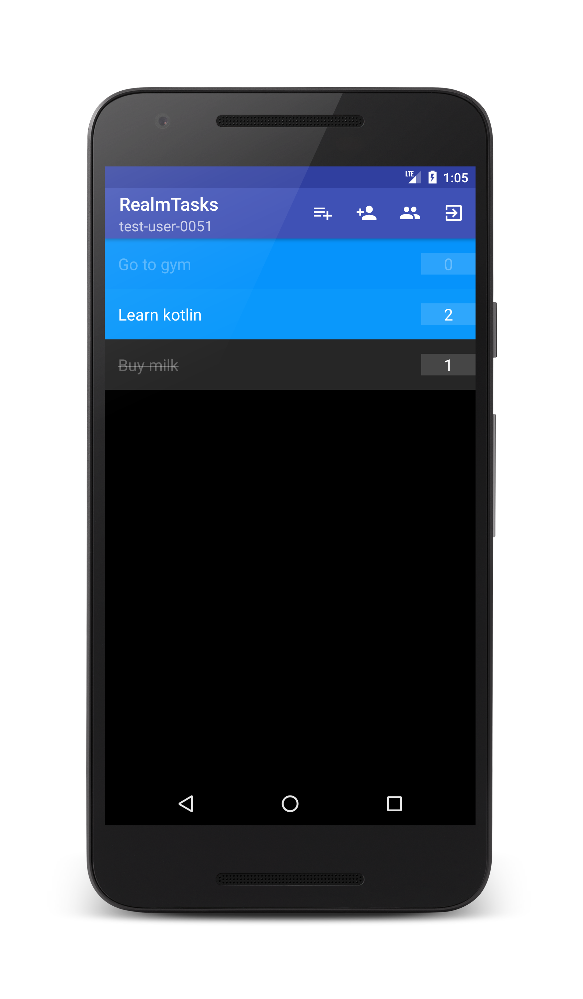

## Realm Task Android with Zerokit
The original sample app of the [Realm Task Android](https://github.com/realm-demos/realm-tasks/tree/master/RealmTasks%20Android) extended with the functionality of **Zerokit SDK**


### Features
* Login / Registration
* Create / Delete task list.
* Create / Delete task.
* Share task list
* Revoke share

## Requirements
  - **Android SDK:** The _Zerokit SDK_ library is compatible from API 21 (Android 5.0 - Lollipop).
  - **IDE:** You will need an installed _Android Studio_ to open and build the project.
  - **Backend:** An installed and working ZeroKit-Realm backend, according to [this description](https://github.com/tresorit/ZeroKit-Realm-encrypted-tasks).

## Configuration
Before build, you have to configure the application to work together with your backend services.

### Zerokit
The example app requires a backend to function. The previous guide in the root of this repository describes a backend that you can use for this app. You can find the backend and setup instructions [here](https://github.com/tresorit/ZeroKit-Realm-encrypted-tasks).
If your backend is up and running, you can move on with the configuration of the mobile app.

In the `src/main/AndroidManifest.xml` set the values for `com.tresorit.zerokitsdk.API_ROOT`.
```xml
<meta-data
     android:name="com.tresorit.zerokitsdk.API_ROOT"
     android:value="YOUR API ROOT HERE (eg. https://yourtenant.api.tresorit.io)"/>
```

In the `app/src/main/assets/zerokit.properties` set the values of `clientid` and `appbackend`. If this file does not exist, let’s create one with the same name.
```
clientid={client id for your openid}
appbackend={url of the sample application backend}
```

- `apiroot`: This is your tenant's service URL. You can find this URL on the management portal.
- `clientid`: This is the client ID for your OpenID Connect client that you wish to use with your mobile app.
- `appbackend`: This is the URL of the sample application backend.

_**Note:** You can find these values on the basic configuration page of your tenant at [https://manage.tresorit.io](https://manage.tresorit.io)_

### Realm
In the `app/build.gradle` configure the **IP address** and **port** for your **Realm Object Server**. You can set these values in `buildTypes` section with the help of the appropriate `buildConfigField`
```xml
buildTypes {
    ... {
        buildConfigField "String", "OBJECT_SERVER_IP", "\"YOUR OBJECT SERVER IP HERE\""
        buildConfigField "int", "OBJECT_SERVER_PORT", "YOUR OBJECT SERVER PORT HERE"
    }
    ...
}
```

Now you are ready to **Build and Run** the example in **Android Studio**.

# Application

#### Modules
* **adminapi**: Most of the cryptographic operations (including invites and sharing) must be done client side by the SDK library. To provide control over these operations, and to prevent possible abuse by tampering the client, we introduced the admin API. All client initiated changes which has a permanent effect on the server has to be approved through the Admin API (typically by the server backend of the integrated app).

* **app**: Contains the source code of the original sample app of the [Realm Task Android](https://github.com/realm-demos/realm-tasks/tree/master/RealmTasks%20Android) extended with the **Zerokit SDK**
    * The _`TaskListList`_ is shareable, so it is now possible to provide access rights for different users to handle the same task list.
    * The text fields of _`Task.java`_ and _`TaskList.java`_ are handled in encrypted way, so unauthorized users can no access to these data.
    * The logged in user can share his/her list with an other user. The revocation of these shares are also possible.
    * The user can see two member lists, in the first can be found those members who have shared their task list with the current user, in the second one are located those users who have access to the current user's task list.
    
#### Used 3rd party libraries
- [Retrofit](https://github.com/square/retrofit): Type-safe HTTP client for Android and Java
- [okhttp](https://github.com/square/okhttp): An HTTP+HTTP/2 client for Android and Java applications
- [Retrolambda](https://github.com/evant/gradle-retrolambda): A gradle plugin for getting java lambda support in java 6, 7 and android